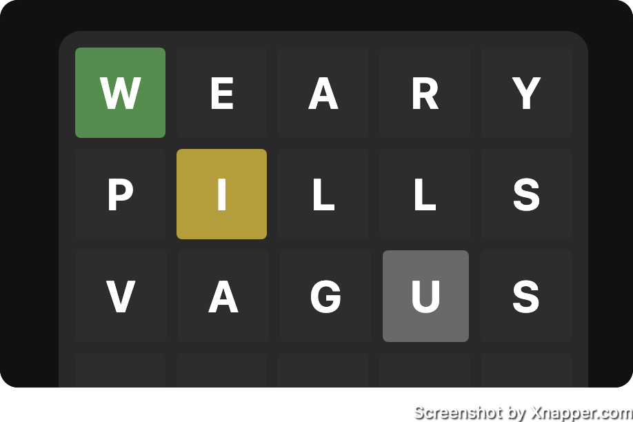

# Wordle

This repository is clone of the popular game Wordle, along with additional features and improvements. You can try the live version of the game [here](https://foadbotan.github.io/wordle/).

## Technologies Used

The game is built using HTML, CSS, and JavaScript. It is hosted on GitHub Pages. Tested using Vitest (❤️)

## Approach

The game logic of Wordle is straightforward, with the challenge lying in preventing the reuse of characters that have already been found. To address this, a two-step approach was taken. First, the tiles were looped over to clear the exact matches (indicated by green color), and then the partial matches (indicated by yellow color) were cleared. During the first loop, a list of unmatched characters was built, which was checked against during the second loop.

## Testing

Additionally, testing was implemented on a separate branch (testing) using Vitest.

This was my first experience with testing, and I found it to be productive. I had to isolating the game logic from DOM manipulations to implement unit tests. This separation of concerns lead to improved code organization and simplification.

## Installation (Testing Branch)

If you wish to test the additional features implemented in the testing branch, follow these steps:

1. `npm install` to install the necessary dependencies.
2. `npm run test` to run the tests.

Please note that there are no installation instructions for the main branch, as it uses a static site with vanilla JavaScript.

## Unsolved Problems

An alerting system was built from scratch to provide notifications, but it currently lacks keyboard support, specifically the ability to press Enter to start a new game. To address this limitation, work has begun on transitioning to using the HTML dialog element, which comes with built-in form support. The "How-To" dialog has already been implemented and functions well, but it lacks the animated transitions found in the custom alerts.

## Extra Features

The following features were added to the game:

- Secret hints hidden in the console: The console can be used to reveal the answer or a hint. This is useful for testing purposes, or if you're stuck and need a little help.
- How-To: A dialog that explains the rules of the game.
- Keyboard Support: The game can be played using the keyboard, with the Enter key used to submit guesses.
- Custom Alerts: Custom alerts were built from scratch to provide notifications to the player.
- Testing: Unit tests were implemented using Vitest.
- Animations: Animations were added to the game to provide a more engaging experience.
- Responsive Design: The game is fully responsive and can be played on any device.

## Todo

Additional features that could be added to the game:

- Custom reset function: Instead of reloading the page, a custom reset function that provides a seamless game restart experience.
- Save to localStorage: Save game progress, allowing players to continue from where they left off even after closing the browser.
- Game statistics: Keep track of game statistics, providing players with information such as the number of games played, games won, and success rate.
- Social media sharing: Allow players to easily share their wins on social media, to foster competition and engagement.
